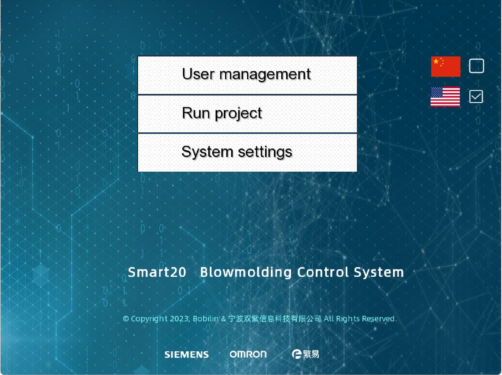

# 系统概述 | Overview

**Smart20 BlowmoldingControlSystem** 
基于HMI+PLC 的吹塑机控制系统 A Blowmolding Control System Base by HMI+PLC 

## 演示 | Show

### 首页

### 部分1

### 部分2

 

## 关于作者 | About author

  Bobilin，一个原生而不纯粹的机械工程师，一个纯粹的自动化控制技术爱好者，一个零基础计算机技术的学习者。

