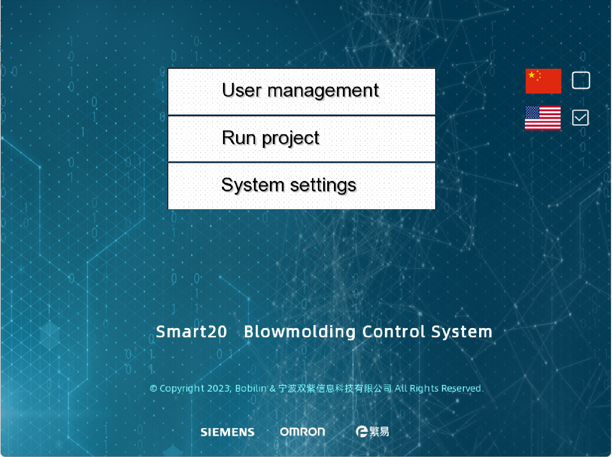

============
Smart20
============

基于HMI+PLC，功能齐全，性能优异，代码开放，免费开源的的吹塑机控制系统。

:首页图片:

**Smart20** 初识
-----------------
.. note:: 在文章以后绪述中，如无特殊声明， **系统** 代表 **Smart20 BlowmoldingControlSystem**,  **系统文档** 代表 **Smart20-Docs** 也就是本文 .

:doc:`brief`:  介绍 **系统** 的技术架构

:doc:`feature`:  **系统** 特点和性能优势

:doc:`show`:  **系统** Gif图片演示

:doc:`open`:  **系统** 开源的历程和开源事项

:doc:`license`: **系统** & **系统文档** 的开源协议
  

**Smart20** 进级
-------------------

**Smart20** 高级
--------------------

.. toctree:: 
   :maxdepth: 2
   :hidden:
   :caption: 🚀 Smart20初识
   
   brief
   feature
   show
   open
   license

.. toctree:: 
    :maxdepth: 2
    :hidden:
    :caption: 💡 Smart20进级

    environment/index
    hmi/index

.. toctree:: 
    :maxdepth: 2
    :hidden:
    :caption: 🪄 Smart20高级

    docs/tutorials

